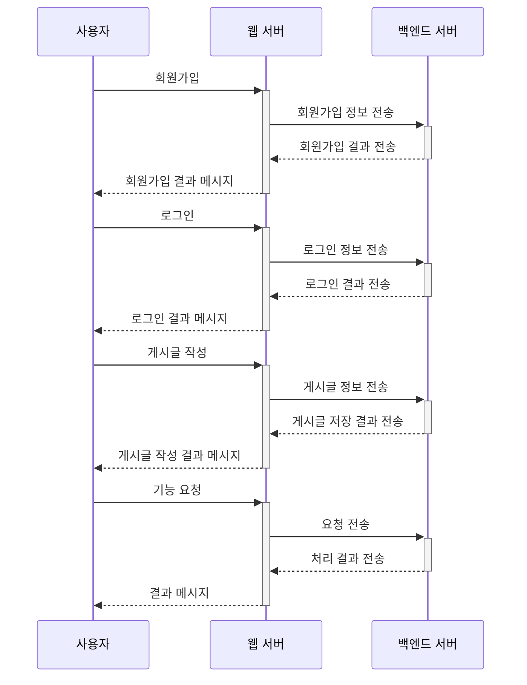
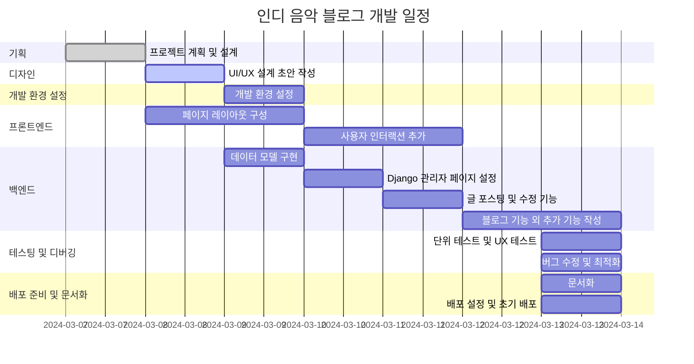

# 인디 음악 블로그

## 블로그 소개

이 블로그는 인디 음악 애호가들을 위한 공간입니다. 인디 음악의 새로운 트렌드, 아티스트 소개, 음악 리뷰, 그리고 인디 음악과 관련된 다양한 이벤트 정보를 제공합니다. 
음악을 사랑하는 모든 분들이 자유롭게 의견을 나누고, 새로운 음악을 발견하는 장소가 되기를 바랍니다.

## 1. 목표와 기능

### 1.1 목표

- **인디 음악 소개**: 새롭게 떠오르는 인디 아티스트와 그들의 음악을 소개합니다.
- **음악 리뷰**: 다양한 인디 앨범과 싱글에 대한 깊이 있는 리뷰를 제공합니다.
- **커뮤니티 구축**: 인디 음악 애호가들이 서로 소통하고, 음악을 공유할 수 있는 커뮤니티를 만듭니다.
- **이벤트 정보 제공**: 인디 음악 관련 이벤트, 콘서트, 페스티벌 등의 정보를 제공합니다.
- **아티스트 지원**: 인디 아티스트들이 자신의 음악을 홍보하고, 더 많은 청중에게 도달할 수 있도록 지원합니다.

### 1.2 기능

#### 1. 아티스트 소개
- 신예 인디 아티스트와 그들의 작업에 대한 소개
- 아티스트 인터뷰와 독점 콘텐츠

#### 2. 음악 리뷰
- 최신 인디 앨범과 싱글에 대한 리뷰
- 사용자들의 의견과 평가를 공유하는 섹션

#### 3. 커뮤니티 포럼
- 음악 추천, 경험 공유, 음악 관련 질문에 대한 답변을 공유하는 공간
- 사용자 생성 콘텐츠와 토론을 장려하는 포럼

#### 4. 이벤트 정보
- 국내외 인디 음악 이벤트와 콘서트 일정 공유
- 이벤트 관련 리뷰와 사용자 경험담

#### 5. 아티스트 지원 프로그램
- 아티스트의 음악과 프로필을 소개하는 플랫폼
- 사용자들과 직접 소통할 수 있는 특별 섹션

## 2. 개발 환경 및 배포 URL
### 2.1 개발 환경
- Web Framework
  - Django 5.x (Python 3.12)

### 2.3 URL 구조(모놀리식)
- main

| App       | URL                                        | Views Function | HTML File Name  | Note           |
|-----------|--------------------------------------------|----------------|-----------------|----------------|
| main      | '/'                                        | Main           | blog/index.html | 홈화면          |

- accounts

| App       | URL                                        | Views Function    | HTML File Name                        | Note           |
|-----------|--------------------------------------------|-------------------|---------------------------------------|----------------|
| accounts  | 'register/'                                | register          | accounts/register.html                |회원가입         |
| accounts  | 'login/'                                   | login             | accounts/login.html                   |로그인           |

- blog

| App       | URL                                        | Views Function    | HTML File Name                       | Note           |
|-----------|--------------------------------------------|-------------------|--------------------------------------|----------------|
| blog      | 'blog/'                                    | blog              | blog/blog.html                       |갤러리형 게시판 메인 화면  |
| blog      | 'blog/<int:pk>/'                           | post              | blog/post.html                       |상세 포스트 화면    |
| blog      | 'blog/write/'                              | write             | blog/write.html                      | 카테고리 지정, 사진업로드,  게시글 조회수 반영|
| blog      | 'blog/edit/<int:pk>/'                      | edit              | blog/edit.html                       | 게시물목록보기 |
| blog      | 'blog/delete/<int:pk>/'                    | delete            | blog/delete.html                     | 삭제 화면      |
| blog      | 'blog/search/'                             | search            | base.html                            | 주제와 카테고리에 따라 검색,  시간순에 따라 정렬|
| blog      | 'post/<int:post_pk>/comment/'              | comment_new       | blog/comment_form.html               | 댓글 입력 폼     |

 

## 3. 요구사항 명세와 기능 명세
 - 메인페이지 구현
   - 페이지 제목과 블로그 입장하기 버튼 표시
   - 회원가입/로그인 버튼 제공
   - 회원가입 버튼 클릭 시 회원가입 페이지로 이동
   - 로그인 버튼 클릭 시 로그인 페이지로 이동

 - 회원가입 기능 구현
   - 회원가입 페이지 제공
   - id와 password 입력 받음

 - 로그인 기능 구현
   - 로그인 페이지 제공
   - id와 password 입력 받음

 - 게시글 작성 기능 구현
   - 로그인한 사용자만 이용 가능
   - 게시글 제목과 내용 작성 페이지 제공
   - 사진 업로드 가능
   - 게시글 저장 및 목록에 표시
   - 게시글 조회수 증가

 - 게시글 목록 기능 구현
   - 모든 사용자가 게시한 블로그 게시글 제목 확인 가능
 
 - 게시글 상세보기 기능 구현
   - 게시글의 제목/내용 확인 가능
 
 - 게시글 검색 기능 구현
   - 주제와 태그에 따라 검색 가능
   - 검색 결과 시간순으로 정렬 가능

 - 게시글 수정 기능 구현
   - 로그인한 사용자만 이용 가능
   - 본인의 게시글만 수정 가능
   - 게시글 제목과 내용 수정 페이지 제공

 - 게시글 삭제 기능 구현
   - 로그인한 사용자만 이용 가능
   - 본인의 게시글만 삭제 가능
   - 삭제 후 게시글 목록으로 이동 및 삭제된 게시글 접근 불가능 페이지 표시

 - 회원 관련 추가 기능
   - 비밀번호 변경 기능
   - 프로필 수정 기능
   - 닉네임 추가 기능

 - 댓글 기능
   - 댓글 추가
   - 댓글 삭제
   - 대댓글 기능
   - 댓글 수정 기능

 - 부가 기능
   - 정적 파일 모으기 (collectstatic)
   - 번역 기능 (en, kr)
  

## 4. 프로젝트 구조와 개발 일정
### 4.1 프로젝트 구조
- 해당 프로젝트에서 폴더 트리 잘 다듬어 사용하세요. 필요하다면 주석을 달아주세요.
📦📦django-website
 ┣ 📂accounts
 ┃ ┣ 📂migrations
 ┃ ┃ ┣ 📂__pycache__
 ┃ ┣ 📂__pycache__
 ┃ ┣ 📜admin.py
 ┃ ┣ 📜apps.py
 ┃ ┣ 📜models.py
 ┃ ┣ 📜tests.py
 ┃ ┣ 📜urls.py
 ┃ ┣ 📜views.py
 ┃ ┗ 📜__init__.py
 ┣ 📂blog
 ┃ ┣ 📂migrations
 ┃ ┃ ┣ 📂__pycache__
 ┃ ┃ ┣ 📜0001_initial.py
 ┃ ┃ ┣ 📜0002_post_views.py
 ┃ ┃ ┣ 📜0003_comment.py
 ┃ ┃ ┗ 📜__init__.py
 ┃ ┣ 📂__pycache__
 ┃ ┣ 📜admin.py
 ┃ ┣ 📜apps.py
 ┃ ┣ 📜forms.py
 ┃ ┣ 📜models.py
 ┃ ┣ 📜tests.py
 ┃ ┣ 📜urls.py
 ┃ ┣ 📜views.py
 ┃ ┗ 📜__init__.py
 ┣ 📂media
 ┃ ┗ 📂blog
 ┃ ┃ ┣ 📂files
 ┃ ┃ ┃ ┗ 📂2024
 ┃ ┃ ┃ ┃ ┗ 📂03
 ┃ ┃ ┃ ┃ ┃ ┗ 📂12
 ┃ ┃ ┗ 📂images
 ┃ ┃ ┃ ┗ 📂2024
 ┃ ┃ ┃ ┃ ┗ 📂03
 ┃ ┃ ┃ ┃ ┃ ┣ 📂12
 ┣ 📂static
 ┃ ┣ 📂assets
 ┃ ┃ ┣ 📂img
 ┃ ┃ ┃ ┣ 📜about-bg.jpg
 ┃ ┃ ┃ ┣ 📜contact-bg.jpg
 ┃ ┃ ┃ ┣ 📜home-bg.jpg
 ┃ ┃ ┃ ┣ 📜post-bg.jpg
 ┃ ┃ ┃ ┗ 📜post-sample-image.jpg
 ┃ ┃ ┗ 📜favicon.ico
 ┃ ┣ 📂css
 ┃ ┃ ┗ 📜styles.css
 ┃ ┗ 📂js
 ┃ ┃ ┗ 📜scripts.js
 ┣ 📂templates
 ┃ ┣ 📂accounts
 ┃ ┃ ┣ 📜login.html
 ┃ ┃ ┗ 📜register.html
 ┃ ┣ 📂blog
 ┃ ┃ ┣ 📜index.html
 ┃ ┃ ┣ 📜post_delete.html
 ┃ ┃ ┣ 📜post_detail.html
 ┃ ┃ ┣ 📜post_form.html
 ┃ ┃ ┣ 📜post_list.html
 ┃ ┃ ┗ 📜post_update_form.html
 ┃ ┗ 📜base.html
 ┣ 📂tutorial_django
 ┃ ┣ 📂__pycache__
 ┃ ┃ ┣ 📜settings.cpython-312.pyc
 ┃ ┃ ┣ 📜urls.cpython-312.pyc
 ┃ ┃ ┣ 📜wsgi.cpython-312.pyc
 ┃ ┃ ┗ 📜__init__.cpython-312.pyc
 ┃ ┣ 📜asgi.py
 ┃ ┣ 📜settings.py
 ┃ ┣ 📜urls.py
 ┃ ┣ 📜wsgi.py
 ┃ ┗ 📜__init__.py
 ┣ 📜.gitignore
 ┣ 📜db.sqlite3
 ┣ 📜manage.py
 ┗ 📜README.md 

### 4.1 개발 일정(WBS)
* 아래 일정표는 머메이드로 작성했습니다.

## 6. 와이어프레임 / UI / BM

### 6.1 와이어프레임
- 아래 페이지별 상세 설명, 더 큰 이미지로 하나하나씩 설명 필요

- 와이어 프레임은 디자인을 할 수 있다면 '피그마'를, 디자인을 할 수 없다면 '카카오 오븐'으로 쉽게 만들 수 있습니다.

### 6.2 화면 설계
- 화면은 gif파일로 업로드해주세요.

## 7. 데이터베이스 모델링(ERD)

* 아래 ERD는 머메이드를 사용했습니다.

* 아래 ERD는 [ERDCloud](https://www.erdcloud.com/)를 사용했습니다.

* https://dbdiagram.io/home도 많이 사용합니다.

## 8. Architecture

* 아래 Architecture 설계도는 ChatGPT에게 아키텍처를 설명하고 mermaid로 그려달라 요청한 것입니다.

* 아래 Architecture 설계도는 PPT를 사용했습니다.
  

- PPT로 간단하게 작성하였으나, 아키텍쳐가 커지거나, 상세한 내용이 필요할 경우 [AWS architecture Tool](https://online.visual-paradigm.com/ko/diagrams/features/aws-architecture-diagram-tool/)을 사용하기도 합니다.

## 9. 메인 기능

## 10. 에러와 에러 해결
## 11. 개발하며 느낀점